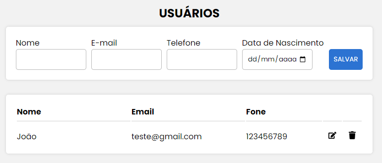

# Sample CRUD | React JS Node.js MySQL

### Layout


## Índice

- [Instalação](#instalação)
- [Autor](#autor)
- [Tecnologias](#tecnologias)
- [Bibliotecas / Dependências](#Bibliotecas_E_Dependências)
- [Agradecimentos](#agradecimentos)

## Instalação

Instruções para instalar e configurar o projeto.

```sh
# Clone o repositório
git clone https://github.com/yLucino/sample-crud.git

# Navegue até o diretório do projeto
cd repo

# Instale as dependências
npm install

# Inicie o projeto frontend com os comandos:
cd frontend
npm start

# Inicie o projeto backend com os comandos:
cd backend
npm start

### Lembre-se de criar um database para utilizar no projeto.
```

## Autor

Luciano Chiodini - yLucino
<div> 
  <a href
="https://www.instagram.com/luci_ano_chi/" target="_blank"></a>
  <a href = "mailto:chiodiniluciano@gmail.com"></a>
  <a href="https://www.linkedin.com/in/luciano-chiodini-6a35092b3/" target="_blank"></a>
</div>

## Tecnologias

<div style="display: inline_block"><br>
  
  
  
  
  
  
</div>

## Bibliotecas_E_Dependências
<div style="display: inline_block">
  <p>BACKEND: express | cors | nodemon | mysql</p>
  <p>FRONTEND: axios | styled-components | react-icons | react-toastify</p>
</div>

## Agradecimentos

Obrigado por visitar meu repositório! 🙂🫡